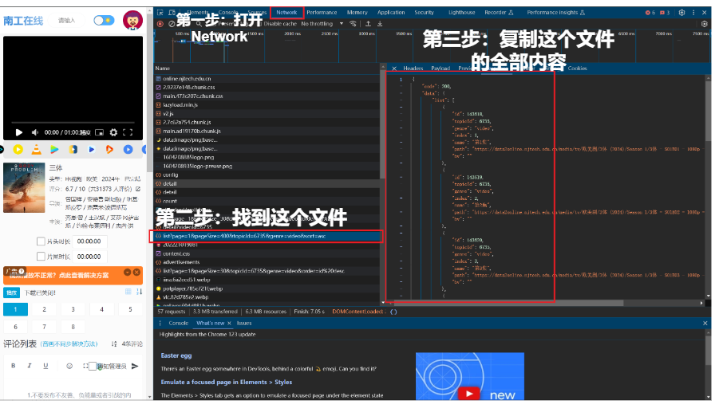

# 一个可以说是只针对南工在线的下载器

<!-- main.py 是第一版的下载器，又臭又长我们不多赘述 -->

在终端运行

```
git clone https://github.com/ptsfdtz/URL-downloader.git
cd ./URL-downloader
pip install -r requirments.txt
```

打开南工在线，并且找到你想要下载的内容，按下`F12`



将复制的内容粘贴到`API.txt`这个文件中

然后运行`app.py`即可
