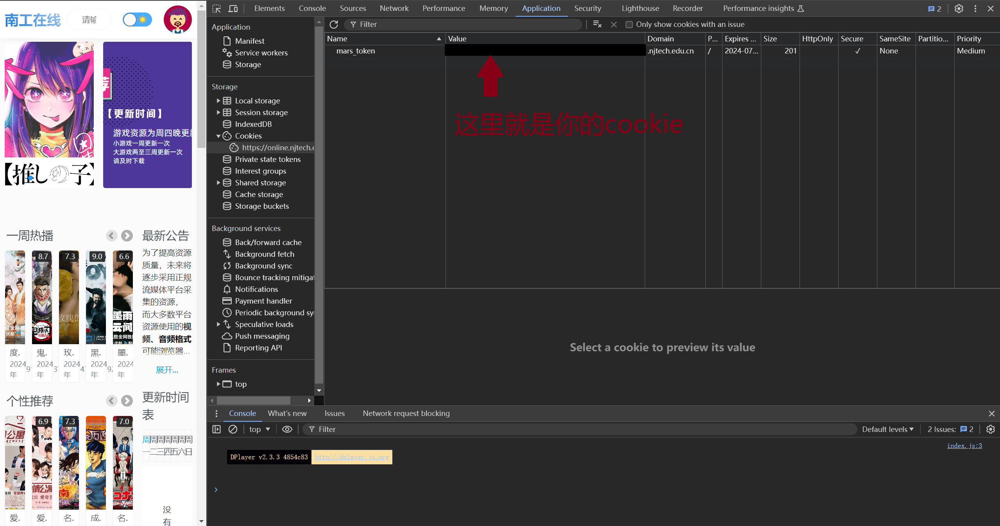
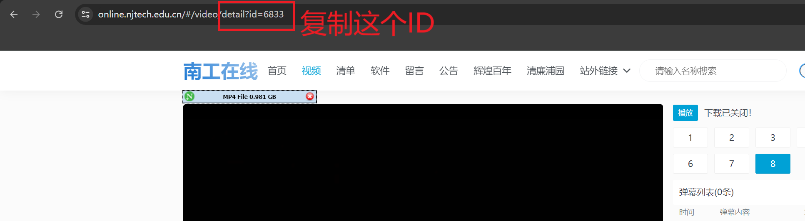

# 一个用于南工在线的下载器

**:exclamation::exclamation::exclamation:<font face="黑体" color=red size=5>本仓库只是用来给同学们离开南工后还能流畅免费的观看一些优秀的视频作品，请勿用于下载传播</font>:exclamation::exclamation::exclamation:**

```
git clone https://github.com/ptsfdtz/URL-downloader.git
cd ./URL-downloader
pip install -r requirments.txt
notepad cookie.txt
```

在根目录下新建一个`cookie.txt`文件



找到你的 `cookie` 复制粘贴到`cookie.txt`中

格式为 mars_token=XXXXXXXXXXXXXXXXXXXXXXXXXXXX

## 找到你想要下载的视频，然后复制 ID



## 运行 main.py 之后输入 ID 即可
